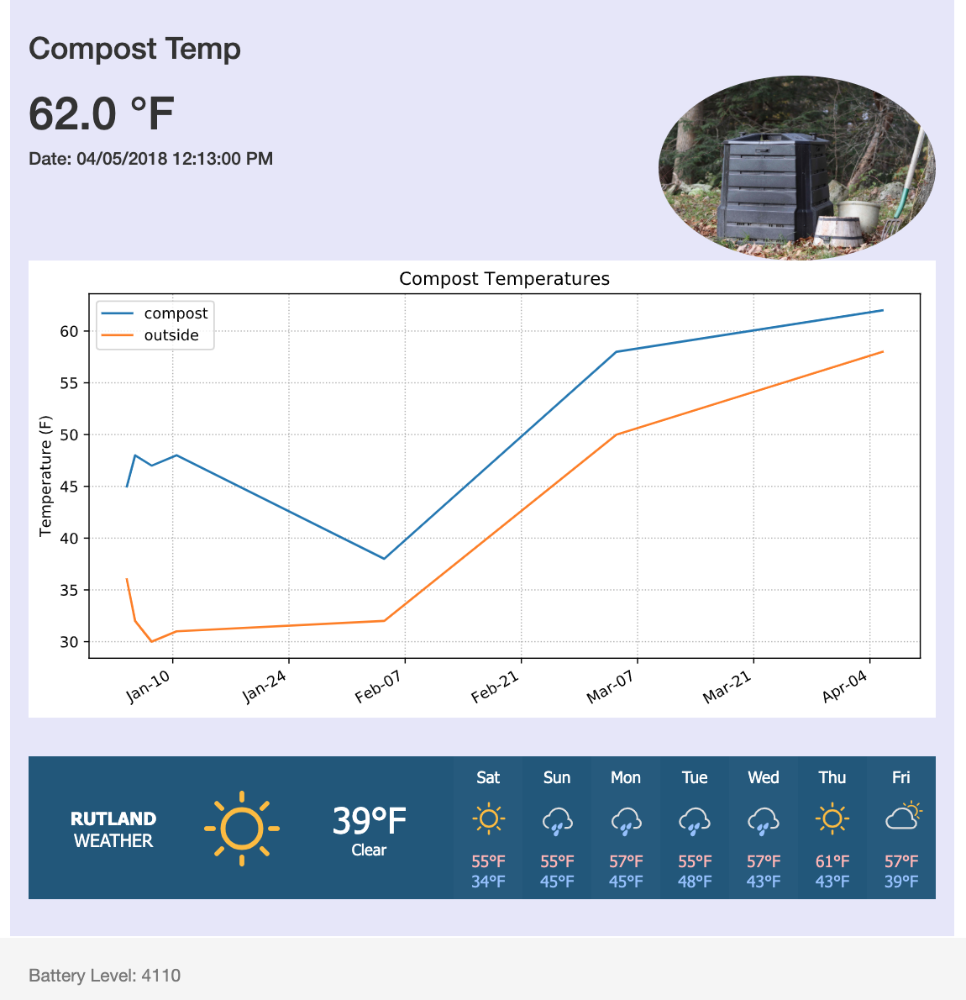
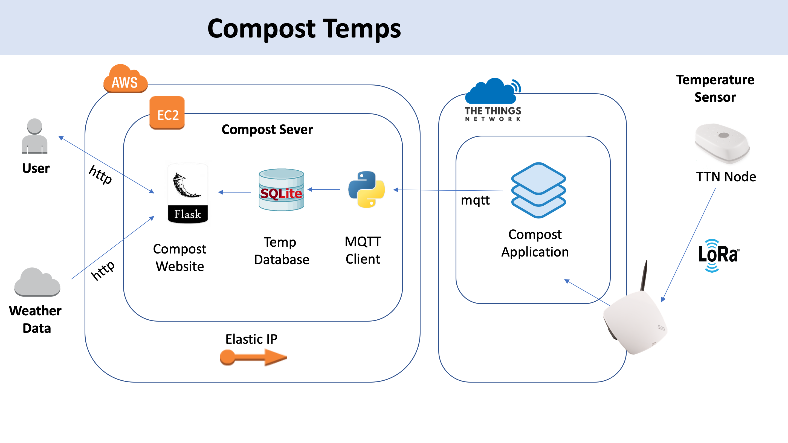

# Compost Temp


This project uses an IOT Temperature Sensor communicating via LoRaWAN
to track the temps in my wife’s garden compost which is deep in our
backyard and outside the reach of any WiFi. The App creates a simple
website (granted through a somewhat elaborate process) to let her check
on the temps in the compost. If this are working right they should
always be higher than the outside temps.


###### A little background on LoRaWan
The LoRaWAN® specification is a Low Power, Wide Area (LPWA) networking
protocol designed to wirelessly connect battery operated ‘things’ to
the internet in regional, national or global networks, and targets key
Internet of Things (IoT) requirements such as bi-directional
communication, end-to-end security, mobility and localization services.


### Website View of Compost



## Atchitecture
LoRa example using The Things Network




## Note
A config.json file is require. The format is:

```
{
  "app_id":"dhiggs01-compost-temperature",
  "access_key":"ttn-account-v2.xxxxxxxxxxxxxxxxxx"
}
```

